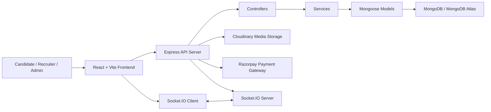
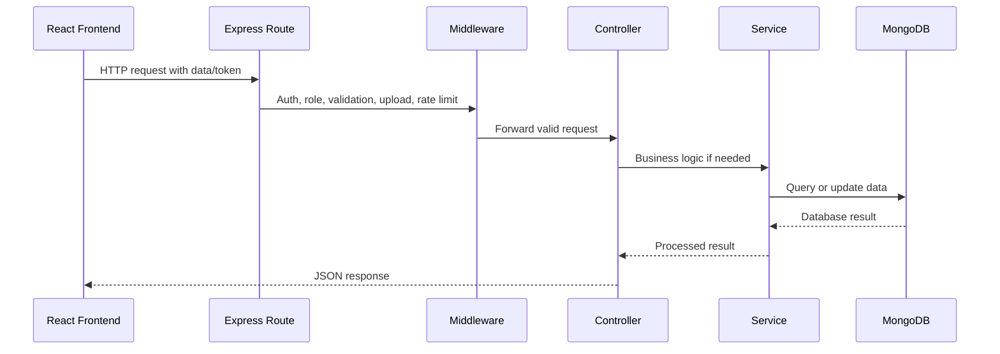

# JewelCancy - MERN Stack Jewellery Recruitment Platform

## Cover Page

| Field | Details |
| --- | --- |
| Project Name | JewelCancy - Jewellery Recruitment and Hiring Platform |
| Subtitle | AI-powered MERN Stack Jewellery Recruitment, Hiring, Subscription, and Career Management System |
| Developer Name | Aakash Joshi |
| Project Type | Full Stack Web Application |
| Technology Stack | React.js, Vite, Node.js, Express.js, MongoDB, Socket.IO, Redux Toolkit, JWT, Cloudinary, Razorpay |
| Version | 1.0.0 |
| Date | May 28, 2026 |
| Deployment Targets | Render, Vercel, Netlify, MongoDB Atlas |

---

## 1. Project Introduction

JewelCancy is a full stack jewellery recruitment and hiring platform built using the MERN stack. The platform connects candidates, recruiters, and administrators through a single digital ecosystem where candidates can search and apply for jobs, recruiters can manage hiring workflows, and admins can control the overall platform operations.

The system was created to solve the common problems found in manual and scattered recruitment workflows. Candidates often struggle to find suitable jobs, track applications, manage resumes, and communicate with recruiters. Recruiters need a structured way to post jobs, manage applicants, schedule interviews, and monitor hiring performance. Administrators need tools to manage users, subscriptions, revenue, blogs, reports, and platform quality.

JewelCancy brings these workflows into one platform with role-based access, real-time chat, notifications, resume management, subscription-based recruiter job posting, blog publishing, multi-language UI support, and analytics.

### Target Users

| User Type | Purpose |
| --- | --- |
| Candidates | Search jobs, build resumes, apply for jobs, track application status, chat with recruiters, receive notifications |
| Recruiters | Create company profiles, buy subscription plans, post jobs, manage applicants, schedule interviews, chat with candidates |
| Admin | Manage users, jobs, recruiters, subscriptions, blogs, reports, revenue, and platform-level moderation |

---

## 2. Project Aim and Objectives

### Main Aim

The main aim of JewelCancy is to provide a modern, scalable, secure, and user-friendly recruitment platform that simplifies jewellery recruitment workflows for candidates, recruiters, and administrators.

### Business Goals

- Provide a professional recruitment platform for job seekers and hiring companies.
- Enable monetization through recruiter subscription plans.
- Improve hiring efficiency using dashboards, analytics, and structured applicant tracking.
- Support content marketing through a built-in blog system.
- Build a platform that can scale from local placement usage to production-level recruitment operations.

### User Goals

- Help candidates find relevant jobs and track applications easily.
- Help recruiters manage job postings and applicants from one dashboard.
- Help admins monitor platform health, revenue, content, users, and reports.
- Provide real-time communication between users.
- Support multiple languages for better accessibility.

### Technical Goals

- Use a modular MERN stack architecture.
- Secure API access using JWT and role-based authorization.
- Manage state with Redux Toolkit and RTK Query patterns.
- Provide real-time communication using Socket.IO.
- Store media securely using Cloudinary and Multer.
- Integrate Razorpay for verified subscription payments.
- Maintain a scalable backend using Express routes, controllers, services, and Mongoose models.

### Scalability Goals

- Support more users, jobs, applications, messages, and notifications over time.
- Keep backend modules independent and maintainable.
- Support future AI features such as resume analysis, job matching, and interview assistance.
- Allow deployment across cloud platforms such as Render, Vercel, Netlify, and MongoDB Atlas.

---

## 3. Key Features

### Candidate Features

- Candidate registration and login.
- JWT-based protected account access.
- Candidate profile management.
- Profile image upload and update.
- Resume upload and resume management.
- Resume builder with PDF generation support.
- Job search and filtering.
- Recommended jobs based on candidate profile and skills.
- Apply for jobs using selected resume.
- Track job application status.
- Save jobs for later.
- Create and manage job alerts.
- Real-time chat with recruiters.
- Notification center with unread count and read/unread status.
- Multi-language user interface.
- Mobile responsive candidate dashboard.

### Recruiter Features

- Recruiter registration and login.
- Recruiter dashboard with hiring overview.
- Company profile creation and update.
- Company logo upload using Cloudinary.
- Subscription plan selection.
- Razorpay payment checkout integration.
- Secure backend payment verification.
- Subscription-based job posting.
- Monthly job posting limits for paid plans.
- Unlimited job posting plans with expiry date enforcement.
- Create, edit, pause, close, and delete jobs.
- Applicant list and candidate data view.
- Applicant tracking board.
- Application status updates.
- Interview scheduling and management.
- Real-time chat with candidates.
- Notifications for applications, interviews, subscription, and job updates.
- Recruiter analytics and performance insights.

### Admin Features

- Admin dashboard with platform statistics.
- User management for candidates, recruiters, and admins.
- Recruiter management and moderation.
- Job management and moderation.
- Company management and verification.
- Application management.
- Blog creation, editing, publishing, and deletion.
- Blog categories, tags, comments, likes, and bookmarks.
- Subscription plan management.
- Recruiter subscription management.
- Revenue analytics and reports.
- Payment transaction visibility.
- Notification system.
- Report generation and report snapshot storage.

---

## 4. Technology and Tools Used

| Technology | Purpose | Version Used in Project |
| --- | --- | --- |
| React.js | Frontend UI development | 19.2.0 |
| Vite | Frontend build tool and dev server | 7.2.2 |
| Node.js | Backend runtime environment | 18+ required |
| Express.js | Backend API framework | 5.1.0 |
| MongoDB | NoSQL database | Atlas/local MongoDB |
| Mongoose | MongoDB ODM and schema modeling | 8.19.3 |
| Redux Toolkit | State management and async logic | 2.11.0 |
| React Redux | React bindings for Redux | 9.2.0 |
| Socket.IO | Real-time communication | Server 4.8.1, Client 4.2.0 |
| JWT | Token-based authentication | jsonwebtoken 9.0.3 |
| Cloudinary | Image and file media storage | 2.8.0 |
| Multer | File upload middleware | 2.0.2 |
| Razorpay | Payment gateway for subscriptions | Backend integration |
| Tailwind CSS | Utility-first UI styling | Tailwind Vite plugin 4.1.17 |
| react-i18next | Multi-language UI translations | 17.0.7 |
| i18next | Translation core | 26.1.0 |
| Framer Motion | UI animation | 12.36.0 |
| Axios | HTTP client | 1.13.2 |
| Helmet | Secure HTTP headers | 8.1.0 |
| CORS | Cross-origin request handling | 2.8.5 |
| Morgan | HTTP request logging | 1.10.1 |
| Compression | Response compression | 1.8.1 |
| Render | Backend deployment | Production target |
| Vercel / Netlify | Frontend deployment | Production target |
| MongoDB Atlas | Cloud database deployment | Production target |

---

## 5. Libraries and Packages Used

### Frontend Libraries

| Package | Purpose |
| --- | --- |
| react | Core UI library |
| react-dom | DOM rendering for React |
| react-router-dom | Client-side routing |
| axios | API requests |
| @reduxjs/toolkit | Redux state management and async logic |
| react-redux | React bindings for Redux |
| socket.io-client | Real-time socket connection from browser |
| react-hot-toast | Toast notifications |
| react-toastify | Toast notification UI support |
| react-i18next | Translation integration with React |
| i18next | Translation engine |
| formik | Form state management |
| yup | Form validation schema |
| framer-motion | Animations and transitions |
| react-icons | Icon library |
| lucide-react | Modern icon components |
| @heroicons/react | Heroicons UI icons |
| date-fns | Date formatting and date utilities |
| react-markdown | Markdown rendering |
| remark-gfm | GitHub-flavored Markdown support |
| rehype-raw | Raw HTML support in Markdown rendering |
| html2pdf.js | Client-side PDF export support |
| @hello-pangea/dnd | Drag and drop board functionality |

### Backend Libraries

| Package | Purpose |
| --- | --- |
| express | API server framework |
| mongoose | MongoDB object modeling |
| jsonwebtoken | JWT token generation and verification |
| bcryptjs | Password hashing |
| socket.io | Real-time server communication |
| multer | File upload handling |
| cloudinary | Cloud media upload and management |
| cors | Cross-origin request control |
| helmet | Security headers |
| dotenv | Environment variable loading |
| morgan | HTTP request logging |
| compression | Response compression |
| express-rate-limit | API rate limiting |
| cookie-parser | Cookie parsing |
| nodemailer | Email notification support |
| pdfkit | PDF generation |
| puppeteer | Browser-based PDF/rendering workflows |
| joi | Environment/config validation |
| express-validator | Request validation |
| hpp | HTTP parameter pollution protection |
| express-mongo-sanitize | NoSQL injection protection |
| xss-clean | XSS input cleaning |
| winston | Logging |
| winston-daily-rotate-file | Rotating production logs |
| jest | Unit testing |
| supertest | API integration testing |
| nodemon | Development server auto-reload |

---

## 6. System Architecture

JewelCancy follows a modular MERN architecture. The frontend is built with React and Vite, while the backend is built with Express.js and MongoDB. The backend follows an MVC-style pattern with separate route, controller, service, middleware, model, and utility layers.

### High-Level Architecture



### Frontend Architecture

The frontend is divided into pages, components, API utilities, Redux slices, hooks, context providers, and i18n translation files.

Main frontend responsibilities:

- Render user interfaces for candidates, recruiters, and admins.
- Manage protected routes based on authentication and role.
- Call backend APIs using a shared Axios instance.
- Store user and application state using Redux Toolkit.
- Connect to Socket.IO for chat and live notifications.
- Support multi-language UI using react-i18next.
- Upload files using FormData requests.

### Backend Architecture

The backend uses Express.js with modular route registration. Each module has its own route file and controller file. Business logic that needs reuse is moved into services.

Main backend responsibilities:

- Handle HTTP API requests.
- Verify JWT tokens.
- Enforce role-based authorization.
- Validate and process uploaded files.
- Communicate with MongoDB using Mongoose models.
- Verify Razorpay payments on the server.
- Enforce recruiter subscription job posting limits.
- Emit real-time events using Socket.IO.
- Handle errors, logging, security, CORS, and rate limiting.

### Database Architecture

MongoDB stores users, companies, jobs, applications, messages, notifications, blogs, subscription plans, payment transactions, usage logs, and interview records. Mongoose schemas define structure, relationships, validation rules, and indexes.

### MVC Architecture

| Layer | Responsibility |
| --- | --- |
| Routes | Define endpoint paths and middleware |
| Controllers | Handle request and response logic |
| Services | Hold reusable business logic |
| Models | Define database schemas and relationships |
| Middleware | Authentication, authorization, upload, language, rate limit, errors |
| Utilities | Logging, notifications, helpers, payment helpers |

### Modular Route Structure

The backend registers routes under `/api/v1`:

- `/api/v1/user`
- `/api/v1/company`
- `/api/v1/jobs`
- `/api/v1/application`
- `/api/v1/dashboard`
- `/api/v1/candidate`
- `/api/v1/chat`
- `/api/v1/notifications`
- `/api/v1/subscription`
- `/api/v1/blogs`
- `/api/v1/blog`
- `/api/v1/admin`
- `/api/v1/interviews`
- `/api/v1/pdf`

---

## 7. API Flow Explanation

### General API Flow



### Login Flow

1. User enters email and password.
2. Frontend sends `POST /api/v1/user/login`.
3. Backend validates required fields.
4. User is found in MongoDB.
5. Password is compared using bcrypt.
6. JWT token is generated.
7. Frontend stores token in localStorage or sessionStorage.
8. Future protected API calls include `Authorization: Bearer <token>`.

### Job Posting Flow

1. Recruiter opens job posting page.
2. Frontend checks subscription usage using `/api/v1/subscription/usage`.
3. Recruiter submits job details.
4. Backend verifies JWT and recruiter role.
5. Subscription middleware checks active plan and expiry.
6. Monthly or unlimited posting rules are enforced on the backend.
7. Job is created only if usage can also be recorded.
8. Usage is stored in `JobPostUsage`.
9. Backend returns success response with created job data.

### Job Application Flow

1. Candidate selects a job.
2. Candidate selects resume and submits application.
3. Frontend sends application data to `/api/v1/application/apply` or `/api/v1/application`.
4. Backend verifies candidate role.
5. Backend checks job availability and duplicate application.
6. Application record is created.
7. Recruiter receives notification.
8. Candidate can track status from candidate dashboard.

### Notification Flow

1. Important events happen, such as application submission, interview scheduling, subscription purchase, or payment failure.
2. Backend creates a notification record in MongoDB.
3. Backend can emit a Socket.IO event to the target user room.
4. Frontend notification UI updates unread count and notification list.
5. User can mark notifications as read or delete them.

### Chat Flow

1. Authenticated user connects to Socket.IO using JWT token.
2. Backend verifies token during socket connection.
3. User joins personal and chat rooms.
4. Messages are sent through socket and saved in the database.
5. Receiver gets real-time message event.
6. Read status and typing indicators are updated using socket events.

### Subscription Payment Flow

1. Recruiter selects a subscription plan.
2. Frontend calls `POST /api/v1/subscription/create-order`.
3. Backend fetches plan price from database, not from frontend.
4. Backend creates Razorpay order.
5. Frontend opens Razorpay checkout using returned order data.
6. Razorpay returns payment response on success.
7. Frontend sends payment data to `POST /api/v1/subscription/verify-payment`.
8. Backend verifies Razorpay signature using backend secret.
9. Backend activates subscription only after valid signature.
10. Payment transaction and subscription records are stored.

---

## 8. Authentication and Security

Security is a major part of the platform because it handles user accounts, job posting rights, payments, file uploads, and real-time communication.

### JWT Authentication

- Login returns a JWT token.
- Frontend stores the token securely in browser storage.
- Protected requests attach the token in the Authorization header.
- Backend verifies token using `JWT_SECRET`.
- Invalid or expired tokens are rejected.

### Protected Routes

Protected backend routes use authentication middleware before controller execution. This prevents unauthenticated users from accessing profile, job posting, chat, admin, subscription, and private dashboard APIs.

### Role-Based Authorization

The platform supports three main roles:

- `candidate`
- `recruiter`
- `admin`

Examples:

- Only candidates can apply for jobs.
- Only recruiters can post jobs.
- Only admins can manage users, subscriptions, and platform reports.

### Password Hashing

Passwords are hashed before storage using bcrypt. The plain password is never stored in the database.

### Rate Limiting

Rate limiting is used to protect the API against abuse:

- General API rate limiting.
- Strict authentication rate limiting for login/register/password endpoints.
- Payment route rate limiting for Razorpay order and verification APIs.
- Chat upload rate limiting.

### Helmet Security

Helmet adds secure HTTP headers to reduce common web vulnerabilities such as clickjacking and MIME sniffing.

### CORS Security

CORS allows only trusted frontend origins. Local development origins and configured production URLs are supported. Credentials are enabled for cookie/token-based workflows.

### File Validation

File upload APIs use Multer and validation rules to control file type and size. Cloudinary stores uploaded images and files.

### Socket Authentication

Socket.IO connections require a JWT token during handshake. The backend rejects socket connections with missing or invalid tokens.

### Payment Verification

Razorpay payments are verified only on the backend using Razorpay signature validation. Frontend payment success alone cannot activate subscriptions.

---

## 9. Database Models

### User

Purpose: Stores candidate, recruiter, and admin accounts.

Main fields:

- `username`
- `email`
- `password`
- `role`
- `phone`
- `accountStatus`
- `recruiterApprovalStatus`
- `profilePicture`
- `profileImage`
- `bio`
- `location`

Relationships:

- Candidate can have applications, resumes, saved jobs, alerts, chats.
- Recruiter can have company, jobs, subscriptions, applications, interviews.
- Admin manages platform-level data.

### CandidateProfile

Purpose: Candidate profile data is represented through user fields, resume records, saved jobs, job alerts, applications, and resume builder data.

Main fields:

- Candidate identity from `User`
- Resume information
- Skills and job profession
- Saved jobs
- Job alerts
- Application history

Relationships:

- Connected to `User`, `Application`, `Resume`, `ResumeBuilder`, `SavedJob`, and `JobAlert`.

### RecruiterProfile

Purpose: Recruiter profile data is represented through user fields, company records, job posts, subscriptions, and applicant management data.

Main fields:

- Recruiter identity from `User`
- Company profile
- Posted jobs
- Subscription status
- Applicant and interview records

Relationships:

- Connected to `User`, `Company`, `Job`, `Application`, `RecruiterSubscription`, and `Interview`.

### Company

Purpose: Stores company profiles created by recruiters.

Main fields:

- `companyName`
- `industry`
- `companyType`
- `size`
- `establishedYear`
- `website`
- `location`
- `description`
- `contactEmail`
- `contactNumber`
- `uploadLogo`
- `cloudinaryPublicId`
- `recruiterId`

Relationships:

- Belongs to one recruiter.
- Can have many jobs.

### Job

Purpose: Stores job postings.

Main fields:

- `title`
- `description`
- `jobProfession`
- `companyId`
- `recruiterId`
- `companyName`
- `location`
- `salary`
- `empType`
- `experience`
- `requirements`
- `status`
- `approvalStatus`

Relationships:

- Belongs to recruiter and company.
- Has many applications.
- Can be saved by candidates.

### Application

Purpose: Stores candidate job applications.

Main fields:

- `jobId`
- `candidateId`
- `recruiterId`
- `companyId`
- `resumeId`
- `coverLetter`
- `status`

Relationships:

- Belongs to candidate, job, recruiter, company, and resume.
- Can have interview records.

### Chat

Purpose: Stores chat room data.

Main fields:

- `participants`
- `lastMessage`
- `unreadCounts`
- `createdAt`
- `updatedAt`

Relationships:

- Has many messages.
- Participants are users.

### Message

Purpose: Stores messages sent inside chat rooms.

Main fields:

- `chatId`
- `senderId`
- `text`
- `attachment`
- `readBy`
- `createdAt`

Relationships:

- Belongs to chat.
- Belongs to sender user.

### Notification

Purpose: Stores system and user notifications.

Main fields:

- `recipient`
- `sender`
- `type`
- `title`
- `message`
- `isRead`
- `metadata`

Relationships:

- Belongs to recipient user.
- May reference jobs, applications, subscriptions, or chats.

### Blog

Purpose: Stores blog content for career resources, platform updates, and SEO pages.

Main fields:

- `title`
- `slug`
- `content`
- `excerpt`
- `coverImage`
- `author`
- `status`
- `categories`
- `tags`
- `likes`
- `comments`

Relationships:

- Author is a user/admin.
- Connected to categories, likes, comments, and bookmarks.

### Subscription

Purpose: Stores recruiter subscription records.

Main fields:

- `recruiterId`
- `planId`
- `status`
- `startDate`
- `endDate`
- `jobPostLimit`
- `jobsPostedCount`
- `remainingPosts`
- `isUnlimited`
- `paymentId`
- `orderId`

Relationships:

- Belongs to recruiter and subscription plan.
- Connected to payment transaction and job post usage logs.

### PaymentTransaction

Purpose: Stores Razorpay payment transaction data.

Main fields:

- `recruiterId`
- `planId`
- `amount`
- `currency`
- `razorpayOrderId`
- `razorpayPaymentId`
- `razorpaySignature`
- `status`
- `verifiedAt`
- `failureReason`

Relationships:

- Belongs to recruiter.
- Belongs to subscription plan.
- Can activate one recruiter subscription.

### Interview

Purpose: Stores scheduled interview data.

Main fields:

- `applicationId`
- `jobId`
- `candidateId`
- `recruiterId`
- `companyId`
- `type`
- `scheduledAt`
- `duration`
- `location`
- `meetingLink`
- `notes`
- `status`

Relationships:

- Belongs to application, job, candidate, recruiter, and company.

---

## 10. Frontend Components and Cards

### Dashboard Cards

Dashboard cards display important statistics such as total jobs, applications, candidates, recruiters, subscription revenue, active subscriptions, and application status counts.

Purpose:

- Give users quick insights.
- Improve dashboard readability.
- Reuse UI patterns across candidate, recruiter, and admin dashboards.

### Job Cards

Job cards display job title, company name, location, salary, experience, job type, and action buttons.

Purpose:

- Present job information clearly.
- Allow candidates to view, save, or apply for jobs.
- Allow recruiters to view or manage posted jobs.

### Applicant Cards

Applicant cards display candidate details, applied job, application status, resume data, and action controls.

Purpose:

- Help recruiters review applicants.
- Support quick status updates.
- Provide access to candidate overview and resume.

### Blog Cards

Blog cards show blog title, category, excerpt, cover image, author, date, and engagement details.

Purpose:

- Display blog content in list and grid layouts.
- Support SEO and career resource browsing.

### Chatbox

The chatbox provides real-time messaging between candidates and recruiters.

Purpose:

- Send and receive messages.
- Upload and download attachments securely.
- Show typing and read status.

### Notification Dropdown

The notification dropdown shows recent notifications and unread counts.

Purpose:

- Keep users updated.
- Provide quick navigation to related actions.

### Sidebar

The sidebar provides role-based navigation links.

Purpose:

- Improve dashboard navigation.
- Separate candidate, recruiter, and admin workflows.

### Navbar

The navbar provides global navigation, profile access, auth actions, and layout consistency.

Purpose:

- Make the app easy to navigate.
- Provide access to account-level actions.

### Language Switcher

The language switcher changes the current UI language.

Purpose:

- Support multilingual users.
- Improve accessibility for regional audiences.

### Subscription Cards

Subscription cards display plan name, price, duration, posting limit, and action buttons.

Purpose:

- Help recruiters compare plans.
- Start Razorpay payment flow.
- Show current subscription and usage.

### Analytics Cards

Analytics cards display revenue, active plans, hiring metrics, applicant trends, and usage.

Purpose:

- Help recruiters and admins make better decisions.
- Support reporting and business monitoring.

---

## 11. UI/UX Design

### Responsive Design

The frontend is designed to work across desktop, tablet, and mobile devices. Layouts use flexible grids, responsive spacing, and mobile-friendly navigation patterns.

### Mobile-First Design

Candidate and public pages are optimized for job search and application workflows on smaller screens. Forms, job cards, dashboards, and navigation are arranged to remain readable on mobile devices.

### Dashboard Layouts

Dashboards use structured cards, tables, charts, and action panels. Each role has its own dashboard experience:

- Candidate dashboard for applications, recommendations, saved jobs, and alerts.
- Recruiter dashboard for jobs, applicants, interviews, and analytics.
- Admin dashboard for users, jobs, reports, revenue, and platform controls.

### Animations

Framer Motion and CSS transitions are used for smooth UI interactions, page transitions, hover effects, and dashboard polish.

### Multi-Language UI

The app uses react-i18next to support translation keys and language switching. UI text can be translated without changing component logic.

### Dark/Light Mode

The project can support dark/light mode as an enhancement. If dark mode is enabled in future versions, colors should be controlled through theme classes or CSS variables.

### Accessibility Improvements

Recommended accessibility practices:

- Use semantic HTML.
- Add labels to form fields.
- Provide alt text for images.
- Ensure keyboard navigation.
- Maintain sufficient color contrast.
- Use visible focus states.

---

## 12. Real-Time Features

Socket.IO powers the real-time layer of JewelCancy.

### Socket.IO Implementation

- Frontend connects using `socket.io-client`.
- Backend creates a Socket.IO server attached to the HTTP server.
- JWT token is passed in socket auth data.
- Backend verifies user before accepting socket connection.

### Live Chat

Users can send and receive chat messages in real time. Messages are also saved to MongoDB, so chat history remains available after refresh.

### Real-Time Notifications

Notification events can be emitted to user-specific rooms when applications, interviews, subscription events, or messages occur.

### Online/Offline Status

When a user connects, the socket server stores their online status and emits user status changes.

### Typing Indicator

The chat system supports typing and stop-typing events inside chat rooms.

### Message Seen Status

Messages can be marked as read when a user opens a chat. Read updates help users understand message status.

---

## 13. Subscription System

The recruiter subscription system ensures that job posting limits are controlled securely by the backend.

### Subscription Plans

| Plan | Price | Posting Limit | Duration |
| --- | --- | --- | --- |
| Starter | INR 599 | 10 job posts per month | 1 month |
| Growth | INR 1199 | 50 job posts per month | 1 month |
| Business | INR 4999 | Unlimited job posts | 6 months |
| Enterprise | INR 12999 | Unlimited job posts | 1 year |

### Monthly Job Posting Limits

Starter and Growth plans reset every calendar month while the subscription is active. Usage is measured using a `monthKey` format such as `2026-05`.

### Unlimited Plans

Business and Enterprise plans allow unlimited job posts until subscription expiry. Every job post is still recorded for audit and reporting.

### Razorpay Payment Integration

Payment flow:

1. Recruiter selects a plan.
2. Backend creates a Razorpay order.
3. Frontend opens Razorpay checkout.
4. Razorpay returns payment data.
5. Backend verifies Razorpay signature.
6. Subscription is activated only after backend verification.

### Usage Tracking

Every successful published job creation creates a `JobPostUsage` record. Deleted, paused, or closed jobs remain counted because usage logs represent historical consumption.

### Subscription Expiry Logic

Expiry is checked during job posting attempts. A cron service can also mark expired subscriptions and send notifications.

---

## 14. Blog System

The blog system helps the platform publish career resources, job market content, announcements, and SEO-friendly articles.

### Blog Creation

Admins or authorized users can create blog posts with title, content, excerpt, tags, categories, and cover image.

### Rich Text and Markdown Editing

The frontend supports Markdown-based blog editing and rendering using `react-markdown`, `remark-gfm`, and related tools.

### Blog Categories

Blog categories organize content for easier discovery.

### SEO Optimization

The blog system can support SEO-friendly slugs, excerpts, tags, and metadata.

### Blog Comments and Likes

Users can interact with blogs through comments, likes, bookmarks, and shares.

### Cloudinary Image Uploads

Blog cover images and inline images can be uploaded to Cloudinary for optimized delivery.

---

## 15. Multi-Language System

JewelCancy uses react-i18next for multi-language UI support.

### react-i18next Setup

Translation files are stored in frontend locale folders. Components use translation keys instead of hard-coded strings where possible.

### Supported Languages

The architecture supports multiple languages. Current and future languages can be maintained in translation JSON files.

Example language categories:

- English
- Hindi
- Gujarati
- Other regional languages as needed

### RTL Support

Right-to-left language support can be added by changing document direction and adding RTL-aware styling when languages such as Arabic are introduced.

### Translation Structure

Recommended structure:

```text
client/src/i18n/
  config.js
  index.js
  locales/
    en/
      common.json
      recruiter.json
      admin.json
      subscription.json
```

### Dynamic Language Switching

Users can switch language from the UI. The selected language can be persisted in browser storage and applied across sessions.

---

## 16. Current Progress and Completed Features

| Feature | Status | Notes |
| --- | --- | --- |
| User authentication | Completed | JWT login, register, logout, protected routes |
| Role-based access | Completed | Candidate, recruiter, admin roles |
| Candidate profile | Completed | Profile and image management |
| Recruiter dashboard | Completed | Jobs, applications, interviews, analytics |
| Candidate dashboard | Completed | Applications, saved jobs, recommendations, alerts |
| Admin dashboard | Completed | Platform statistics and management views |
| Company profile | Completed | Recruiter company registration and update |
| Job posting | Completed | Recruiter job create, edit, delete, status management |
| Subscription job posting control | Completed | Backend enforced limits and usage logs |
| Razorpay payment flow | Completed | Order creation and signature verification |
| Job search | Completed | Public job listing and filters |
| Recommended jobs | Completed | Candidate job recommendation flow |
| Job applications | Completed | Candidate apply and recruiter status update |
| Applicant tracking | Completed | Recruiter applicant views and ATS board |
| Resume upload | Completed | Candidate resume workflows |
| Resume builder | Completed | PDF builder route and UI support |
| Chat system | Completed | Socket.IO chat and secure attachment download |
| Notifications | Completed | Notification APIs, unread count, read status |
| Interview scheduling | Completed | Recruiter interview schedule and status update |
| Blog system | Completed | Blog CRUD, categories, rich content, engagement |
| Multi-language support | Completed | react-i18next architecture |
| Cloudinary integration | Completed | Profile, company, resume, blog uploads |
| API audit script | Completed | Runtime route audit script available |
| Environment validation | Completed | Backend environment validation script |
| Production readiness check | Completed | Backend production check script |

---

## 17. Remaining Features and Future Scope

JewelCancy has strong scope for AI and automation improvements.

### AI Job Recommendations

Use machine learning or embeddings to match candidate resumes, skills, experience, and job descriptions.

### AI Resume Analysis

Analyze uploaded resumes and provide:

- Resume score.
- Missing skills.
- Keyword suggestions.
- Job-fit percentage.
- Formatting improvements.

### AI Interview Assistant

Generate interview questions based on job role, candidate profile, and resume.

### Mobile App

Build Android/iOS app using React Native.

### Email Notifications

Send email notifications for:

- Application submitted.
- Interview scheduled.
- Subscription expiring.
- Payment success or failure.
- Job approval/rejection.

### Video Interview System

Add video interview support using WebRTC or third-party video APIs.

### Advanced Analytics

Add deeper dashboards for:

- Hiring funnel.
- Source tracking.
- Recruiter productivity.
- Candidate engagement.
- Revenue forecasting.

### Machine Learning Features

Possible ML features:

- Skill extraction.
- Resume parsing.
- Candidate ranking.
- Job description quality scoring.

### AI Chatbot

Add chatbot for candidate guidance, recruiter support, and admin help.

### PWA Support

Make the frontend installable as a Progressive Web App with offline support and push notifications.

---

## 18. Challenges Faced

### Socket.IO Connection Issues

Real-time systems require correct socket URL, CORS, authentication, reconnect logic, and room management. Socket token validation was important to prevent unauthorized real-time access.

### API Synchronization

Frontend and backend routes must match exactly. Versioned API paths, aliases, base URL configuration, and protected routes require careful maintenance.

### Role-Based Security

Candidate, recruiter, and admin actions must be separated. Direct API calls must not bypass role rules.

### Multi-Language Handling

Translation keys must be organized well. Hard-coded UI strings should be gradually moved to locale files.

### Cloudinary Uploads

File uploads require correct FormData field names, MIME validation, size limits, Cloudinary configuration, and public URL handling.

### Redux State Management

Authentication state, cached data, notifications, and user profile updates need clean state synchronization.

### Real-Time Synchronization

Chat, notifications, online status, typing indicators, and read status need coordination between database state and socket events.

### Subscription Enforcement

Job posting limits must be checked only on the backend. Frontend indicators are useful for UX, but backend logic must remain the source of truth.

---

## 19. Performance Optimization

### Lazy Loading

Frontend routes and pages are lazy-loaded to reduce initial bundle size.

### Code Splitting

Vite supports code splitting through dynamic imports and route-based lazy loading.

### RTK Query Caching

Redux Toolkit and RTK Query patterns help cache API responses and reduce repeated network calls.

### Optimized API Calls

The shared Axios instance avoids repeated setup and ensures consistent token, language, and error handling.

### Compression

Backend uses compression middleware to reduce response size.

### Image Optimization

Cloudinary can transform and optimize uploaded images for different sizes and formats.

### Skeleton Loaders

Loading states and skeleton UI patterns improve perceived performance.

### Pagination

Job lists, applications, blogs, users, and reports can use pagination to avoid loading too much data at once.

---

## 20. Deployment

### Frontend Deployment

Recommended platforms:

- Vercel
- Netlify
- Render static site

Frontend build command:

```bash
npm run build
```

Frontend output folder:

```text
client/dist
```

### Backend Deployment

Recommended platforms:

- Render Web Service
- Railway
- VPS/PM2
- Docker

Backend start command:

```bash
npm start
```

### MongoDB Atlas

Production database should be hosted on MongoDB Atlas with:

- Network access configured.
- Strong database user password.
- SSL/TLS connection.
- Database backups enabled.

### Environment Variables

Production values must be set in deployment platform environment settings. Secrets must never be committed to Git.

### Production Configuration

Important production checklist:

- Set `NODE_ENV=production`.
- Use strong `JWT_SECRET`.
- Configure MongoDB Atlas URI.
- Configure frontend production URL in CORS env.
- Configure Cloudinary credentials.
- Configure Razorpay credentials.
- Enable HTTPS.
- Run production readiness checks.

---

## 21. Conclusion

JewelCancy is a complete MERN stack jewellery recruitment and hiring platform designed for real-world career and hiring workflows. It supports candidates, recruiters, and administrators with dedicated dashboards, secure authentication, job posting, applications, resumes, interviews, chat, notifications, blogs, subscriptions, payments, analytics, and multi-language support.

The technical implementation follows a modular full stack architecture with React and Vite on the frontend, Express and Node.js on the backend, MongoDB for persistence, Socket.IO for real-time communication, Cloudinary for uploads, Razorpay for payments, and JWT for secure access.

The platform is useful for placement agencies, colleges, training institutes, recruiters, startups, and recruitment platforms. Its subscription system makes it suitable for commercial deployment, while its architecture allows future expansion into AI-powered job matching, resume analysis, interview assistance, analytics, mobile apps, and chatbot features.

Overall, JewelCancy is a scalable and production-oriented project suitable for internship submission, final year project documentation, client presentation, and portfolio showcase.

---

## 22. Appendix

### Environment Variables Example

#### Backend `.env`

```env
NODE_ENV=development
PORT=3000

MONGO_URL=mongodb+srv://<username>:<password>@cluster.mongodb.net/job_placements
# Alternative supported key:
# MONGODB_URI=mongodb+srv://<username>:<password>@cluster.mongodb.net/job_placements

JWT_SECRET=replace_with_strong_secret
JWT_EXPIRE=7d

CLIENT_URL=http://localhost:5173
FRONTEND_URL=http://localhost:5173
PRODUCTION_URL=https://your-frontend-domain.com

CLOUDINARY_CLOUD_NAME=your_cloud_name
CLOUDINARY_API_KEY=your_cloudinary_key
CLOUDINARY_API_SECRET=your_cloudinary_secret

RAZORPAY_KEY_ID=rzp_test_xxxxx
RAZORPAY_KEY_SECRET=your_razorpay_secret

RATE_LIMIT_WINDOW=15
RATE_LIMIT_MAX_REQUESTS=100
AUTH_RATE_LIMIT_WINDOW=15
AUTH_RATE_LIMIT_MAX_REQUESTS=5
```

#### Frontend `.env`

```env
VITE_API_URL=http://localhost:3000/api/v1
VITE_API_BASE_URL=http://localhost:3000
VITE_API_VERSION=/api/v1
VITE_ENABLE_API_VERSIONING=true
VITE_SOCKET_URL=http://localhost:3000
VITE_RAZORPAY_KEY_ID=rzp_test_xxxxx
VITE_DEBUG_MODE=true
```

### API Base URL Examples

| Environment | API Base URL |
| --- | --- |
| Local Backend | `http://localhost:3000/api/v1` |
| Local Frontend | `http://localhost:5173` |
| Production Backend | `https://your-backend.onrender.com/api/v1` |
| Production Frontend | `https://your-frontend.vercel.app` |

### Folder Structure Overview

```text
jewelcancy/
  client/
    src/
      api/
      auth/
      components/
      context/
      hooks/
      i18n/
      pages/
      redux/
      utils/
    package.json
    vite.config.js

  server/
    config/
    controllers/
    middlewares/
    models/
    routes/
    scripts/
    services/
    tests/
    utils/
    server.js
    package.json
```

### Important Commands

#### Backend

```bash
cd server
npm install
npm run dev
npm start
npm run validate-env
npm run production-check
npm run audit:api
npm test
```

#### Frontend

```bash
cd client
npm install
npm run dev
npm run build
npm run preview
npm run i18n:scan
npm run i18n:sync
```

### Setup Instructions

1. Clone or download the project.
2. Open the project folder.
3. Install backend dependencies:

```bash
cd server
npm install
```

4. Create backend `.env` file using the example above.
5. Start backend server:

```bash
npm run dev
```

6. Install frontend dependencies:

```bash
cd ../client
npm install
```

7. Create frontend `.env` file using the example above.
8. Start frontend dev server:

```bash
npm run dev
```

9. Open the frontend in browser:

```text
http://localhost:5173
```

10. Test backend health:

```text
http://localhost:3000/health
```

### Core API Endpoints

| Module | Endpoint Prefix |
| --- | --- |
| User/Auth | `/api/v1/user` |
| Company | `/api/v1/company` |
| Jobs | `/api/v1/jobs` |
| Applications | `/api/v1/application` |
| Dashboard | `/api/v1/dashboard` |
| Candidate | `/api/v1/candidate` |
| Chat | `/api/v1/chat` |
| Notifications | `/api/v1/notifications` |
| Blogs | `/api/v1/blogs` |
| Subscription | `/api/v1/subscription` |
| Admin | `/api/v1/admin` |
| Interviews | `/api/v1/interviews` |
| Resume Builder | `/api/v1/pdf` |

### Testing and Audit Notes

The backend includes an API audit script:

```bash
cd server
npm run audit:api
```

This script checks key route availability and verifies that protected routes respond correctly when authentication is missing or invalid. For authenticated end-to-end testing, provide audit tokens or test login credentials through environment variables.

### Documentation Maintenance

This document should be updated whenever:

- New modules are added.
- API routes change.
- Database models change.
- Deployment configuration changes.
- Subscription plans or payment logic changes.
- New languages are added.
- AI features are implemented.
